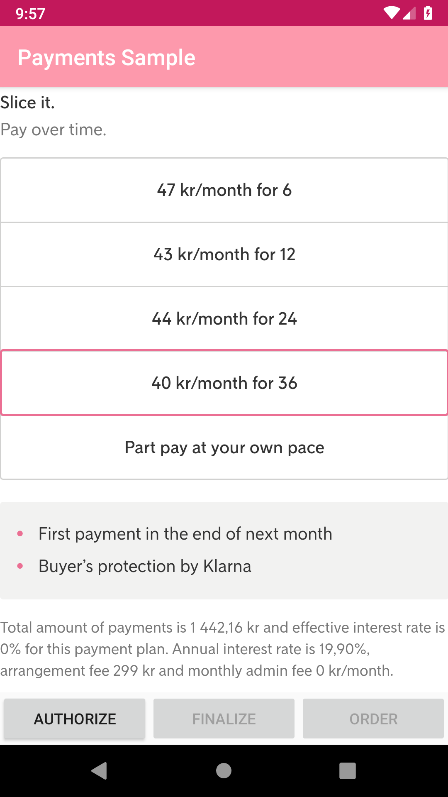
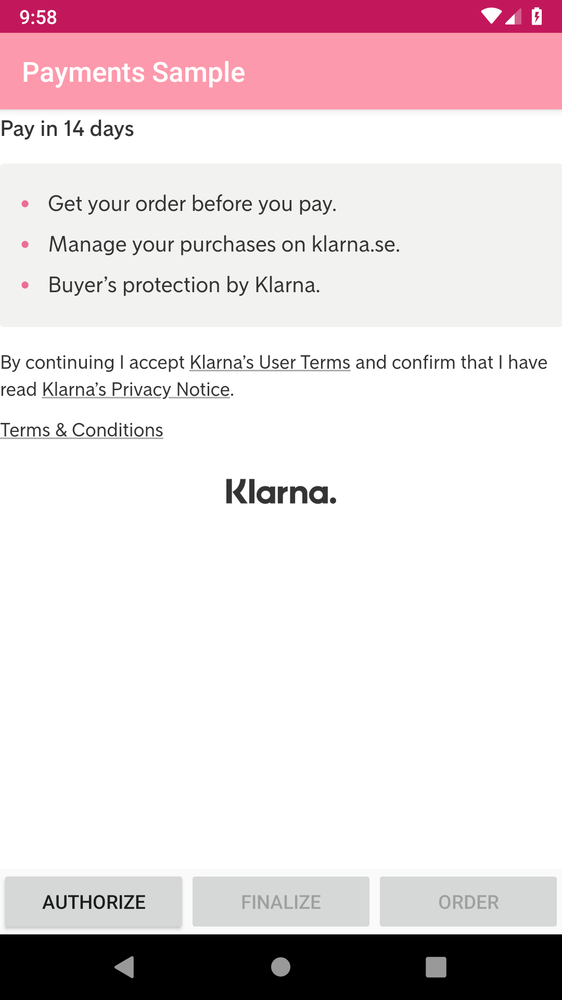
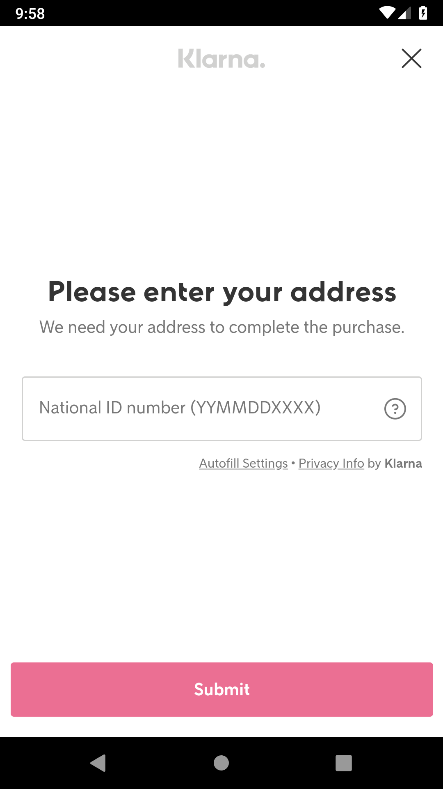

# Klarna In-App SDK for Klarna Payments - Android Example App

This is an example Android app to demonstrate [Klarna In-App SDK](https://github.com/klarna/klarna-mobile-sdk) usage for Klarna Payments.

The Klarna In-App SDK allows merchants to natively integrate Klarna’s products into their apps. This means that you can add services like Klarna Payments to your app and let your customers pay with our payment methods.

**Looking for Klarna Checkout Android Example App?** Check out the [Klarna Checkout Android Example App](https://github.com/klarna/kco-android-example-app) repo on Github.

## What Does Klarna In-App SDK Offer?
Klarna In-App SDK offer two integration approaches: **Native integration** and **Hybrid integration**.

Native integration allows fully native apps to add views with Klarna content to their app. We currently support Klarna Payments, allowing you to add payment views to your checkout and authorizing a session to create an order natively.

Hybrid integration will enhance your customers' experience if your app renders in a web view that presents content from Klarna.

[Read More About the SDK](https://developers.klarna.com/documentation/in-app)

## Setup

* Open the project and enter your Merchant credentials in [`OrderClient`](app/src/main/java/com/klarna/sample/payments/api/OrderClient.kt) file.
* Rebuild the project.
* Run the `app` configuration.

### Native Integration
As previously mentioned Klarna Payments is supported in the native integration. The main idea behind Klarna Payments is to give merchants the ability to offer Klarna’s payment methods to customers. Because Klarna doesn’t own the entire checkout flow, a check needs to be performed before an order is created. Our goal with this integration is to offer you the same simple development experience as you have on the web. As such, integrating Klarna Payments consists of four steps:

1. Creating a session.
2. Rendering the payment view.
3. Authorizing the session.
4. Creating an order.

###Screenshots

  

## Requirements
* Android 4.4 or later.

## Support
If you are having any issues running the SDK in the example app, please create a question on [Stack Overflow](https://stackoverflow.com/questions/tagged/klarna-mobile-sdk) tagged with `klarna-mobile-sdk`. If you think that something is wrong with the example app itself, please create an issue.

### Developer Documentation

* [Overview](https://developers.klarna.com/documentation/in-app/)
* [iOS](https://developers.klarna.com/documentation/in-app/ios/)
* [Android](https://developers.klarna.com/documentation/in-app/android/)

### API Documentation
*  [iOS](https://htmlpreview.github.io/?https://github.com/klarna/klarna-mobile-sdk/blob/master/docs/ios/index.html)
*  [Android](https://htmlpreview.github.io/?https://github.com/klarna/klarna-mobile-sdk/blob/master/docs/android/klarna-mobile-sdk/index.html)

## Contributing
Thank you for reading this and taking time to contribute to Klarna Payments - Android Example App! [Here](https://github.com/klarna/klarna-mobile-sdk/blob/master/CONTRIBUTING.md) is a set of guidelines to help you contribute whether you want to report a bug, come with suggestions or modify code.

## License
Copyright 2018 Klarna Bank AB

Licensed under the Apache License, Version 2.0 (the "License"); you may not use this file except in compliance with the License. You may obtain a copy of the License at

       http://www.apache.org/licenses/LICENSE-2.0
Unless required by applicable law or agreed to in writing, software distributed under the License is distributed on an "AS IS" BASIS, WITHOUT WARRANTIES OR CONDITIONS OF ANY KIND, either express or implied. See the License for the specific language governing permissions and limitations under the License.